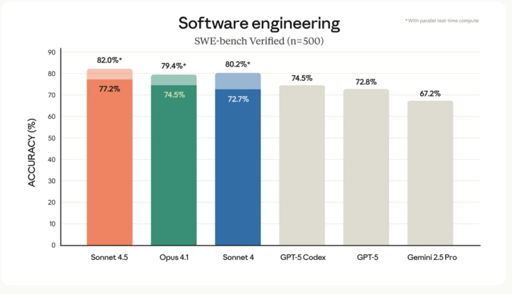
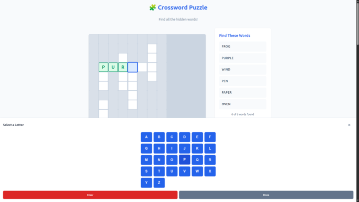
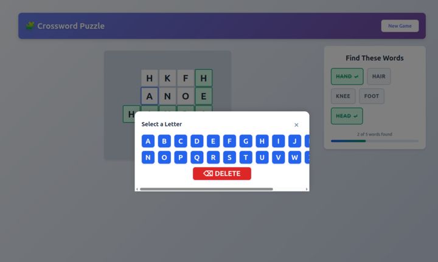

hahaha yesterday I was comparing models and today I got a new one :2025_intensifies: :fomo: You can already try it in Cursor! https://www.anthropic.com/news/claude-sonnet-4-5

A jump to 77% in SWE bench is huge, I am going to try my crossword game with it :D

---

What a bummer, the game is very similar to what Claude Sonnet 4 did, very similar structure also. It took more time and added a lot of documentation files (quick start, how to, readme, features... BUT the puzzles it generates are not correct, they are unsolvable (the crosses are not right) and the letter selector also is worst. Maybe a spec generated by 4.5 would get better results in 4.5 but it is a pain to have to adjust the prompting and context strategies with each new model...

Claude Sonnet 4.0:

Claude Sonnet 4.5:

